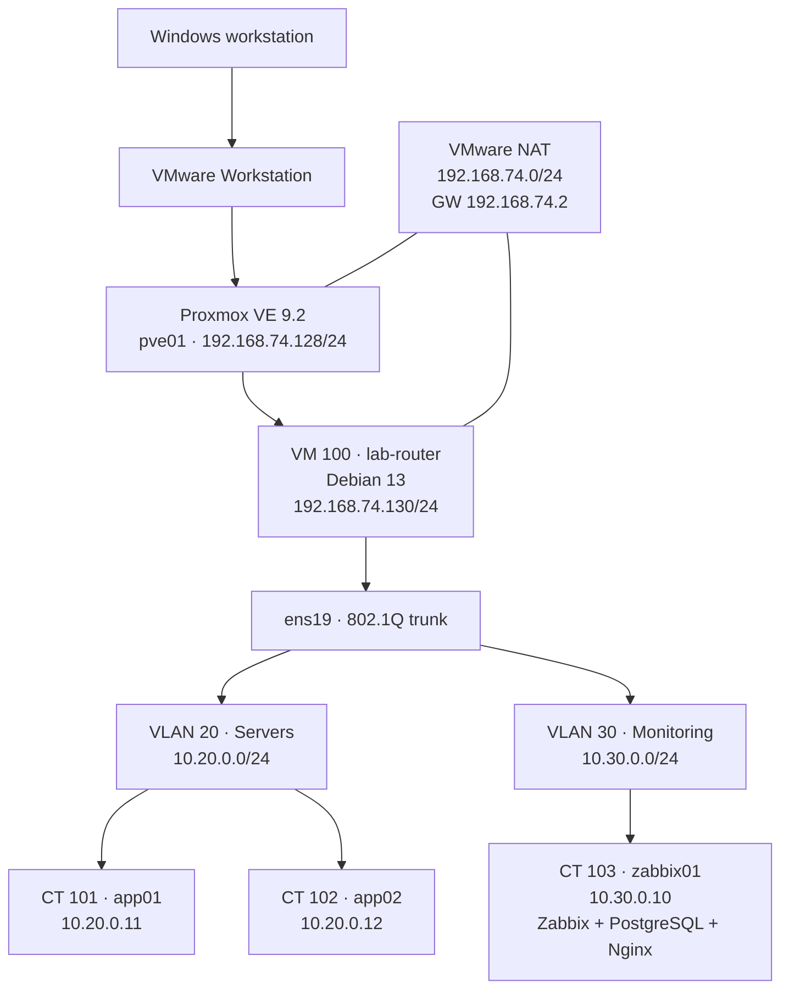
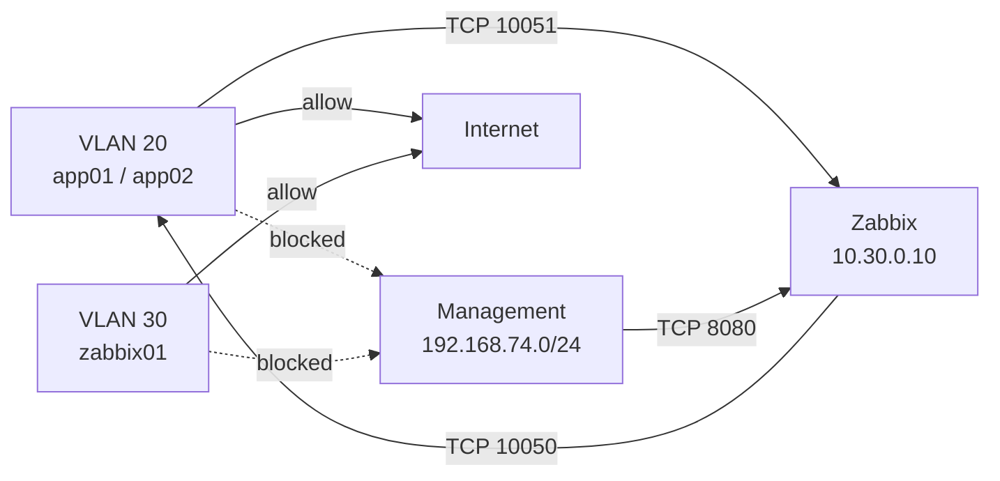
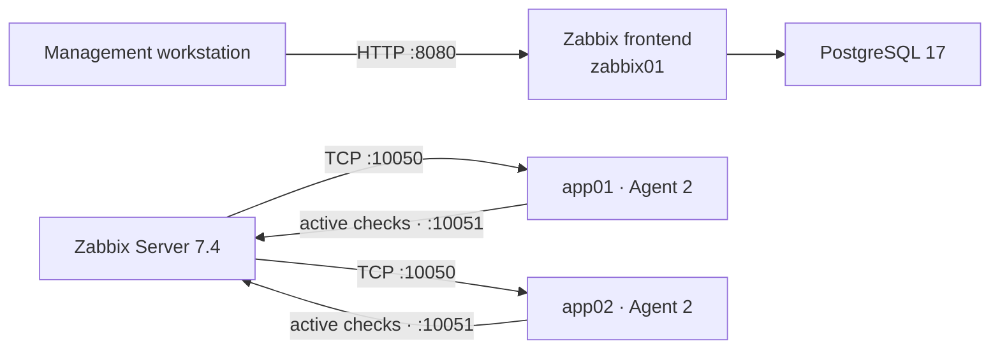
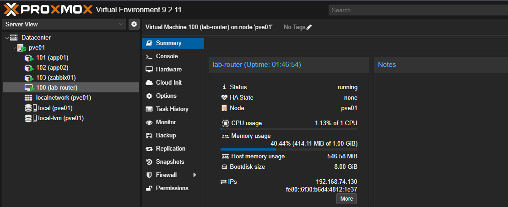
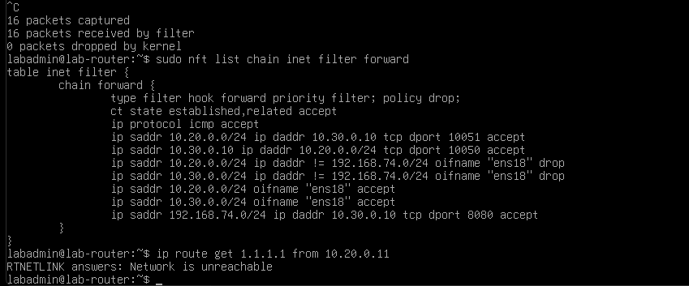

# InfraLab

[](https://github.com/erentechlabs/infralab-homelab/actions/workflows/validate.yml)

A segmented infrastructure homelab built on nested **Proxmox VE**, featuring a Debian router, 802.1Q VLANs, nftables firewalling and NAT, Zabbix monitoring, PostgreSQL, failure simulation, packet-level troubleshooting, and systemd-based operations automation.

> This repository focuses on the **final architecture, sanitized configuration, automation, validation, and troubleshooting evidence**. The full build story — including VMware setup, Proxmox installation, wrong turns, and debugging — belongs in the accompanying blog article.

## Why I built it

I wanted a lab where infrastructure components depended on each other instead of existing as isolated exercises.

That meant building a small environment in which I could practice:

- nested virtualization;
- Linux networking and routing;
- 802.1Q VLAN segmentation;
- default-drop firewall policy;
- NAT and management-plane isolation;
- monitoring and failure detection;
- PostgreSQL-backed infrastructure software;
- packet capture and troubleshooting;
- Bash and systemd automation;
- persistence testing after reboot.

The goal was not just to make the dashboard green. I deliberately broke parts of the environment, traced the failures, corrected them, and then validated that the final state survived a router reboot.

---

## Architecture



### Architecture at a glance

| Component | Role | Address / network |
|---|---|---|
| `pve01` | Proxmox VE hypervisor | `192.168.74.128/24` |
| `lab-router` | Debian router, firewall and NAT gateway | `192.168.74.130`, `10.20.0.1`, `10.30.0.1` |
| `app01` | Debian application container | `10.20.0.11/24` |
| `app02` | Debian application container | `10.20.0.12/24` |
| `zabbix01` | Monitoring server | `10.30.0.10/24` |
| VLAN 20 | Server network | `10.20.0.0/24` |
| VLAN 30 | Monitoring network | `10.30.0.0/24` |
| Management / NAT | VMware-facing network | `192.168.74.0/24` |

Proxmox provides Layer 2 switching. `lab-router` owns Layer 3 routing, forwarding, NAT, and firewall policy.

More detail: **[Architecture](docs/architecture.md)** · **[Network design](docs/network-design.md)**

---

## Firewall policy

The forward chain uses a **default-drop** policy.



The final sanitized ruleset is in [`configs/nftables/nftables.conf.example`](configs/nftables/nftables.conf.example).

---

## Monitoring

`zabbix01` runs:

- Zabbix Server 7.4;
- PostgreSQL 17;
- Nginx;
- PHP-FPM;
- Zabbix Agent 2.

`app01` and `app02` run Zabbix Agent 2 and use the **Linux by Zabbix agent** template.



To prove that monitoring was actually working, I deliberately stopped Agent 2 on `app02`.

```bash
systemctl stop zabbix-agent2
```

Zabbix raised:

```text
Linux: Zabbix agent is not available (for 3m)
```

The service was then restarted and monitoring recovered.

---

## Validation matrix

| Validation | Result |
|---|:---:|
| Nested KVM virtualization | ✅ |
| VLAN 20 / VLAN 30 segmentation | ✅ |
| Inter-VLAN routing | ✅ |
| Internet NAT | ✅ |
| DNS after firewall hardening | ✅ |
| `app01` Zabbix monitoring | ✅ |
| `app02` Zabbix monitoring | ✅ |
| Agent failure detection | ✅ |
| Agent recovery | ✅ |
| Application VLAN → Proxmox management isolation | ✅ |
| Router reboot persistence | ✅ |
| nftables reboot persistence | ✅ |
| Health-check timer persistence | ✅ |
| Backup timer persistence | ✅ |
| Update-check timer persistence | ✅ |

The final router reboot test checked interfaces, routes, nftables, internet access, DNS, timers, and Zabbix availability after the system came back up.

Full test notes: **[Validation](docs/validation.md)**

---

## Troubleshooting highlights

The lab became much more useful when things started failing.

### 1. APT metadata looked like it came from the future

APT repository verification failed with metadata that was “not live until” a future time.

The repository was fine. The system clock was roughly **5491 seconds slow**.

```bash
chronyc makestep
```

After stepping the clock, Chrony reported near-zero offset and repository operations worked again.

### 2. Zabbix frontend worked while the server daemon did not

The Zabbix web installer completed, but the dashboard still reported that the server was not running.

The server log showed:

```text
fe_sendauth: no password supplied
```

The web frontend and the Zabbix server daemon had separate database configuration paths. Adding the PostgreSQL password to the server daemon configuration and restarting it resolved the problem.

### 3. Agent 2 rejected the monitoring server

The configuration file had already been changed, yet the running agent still logged:

```text
connection from "10.30.0.10" rejected, allowed hosts: "127.0.0.1"
```

The process still held the previous configuration.

```bash
systemctl restart zabbix-agent2
```

Validation from `zabbix01`:

```bash
zabbix_get -s 10.20.0.11 -p 10050 -k agent.ping
```

returned:

```text
1
```

### 4. Ping worked, but DNS did not

This was the most useful firewall bug in the project.

An inverted nftables comparison temporarily used:

```nft
ip saddr 10.20.0.0/24 ip daddr != 192.168.74.0/24 oifname "ens18" drop
```

ICMP still worked because it matched an earlier explicit allow rule. DNS traffic did not.

Packet capture:

```bash
tcpdump -ni any 'port 53'
```

showed queries arriving on `ens19.20`, which narrowed the failure to the router's forwarding path.

The correct design was to block the management subnet explicitly and then allow internet egress.

### 5. A timeout proved the security policy

From `app01`:

```bash
curl -k --connect-timeout 5 --max-time 7 \
  https://192.168.74.128:8006 -o /dev/null
echo $?
```

returned exit code `28`.

That timeout was the expected result: application hosts retained internet and monitoring access but could not initiate a connection to the Proxmox management plane.

For the complete debugging notes, see **[Troubleshooting](docs/troubleshooting.md)**.

---

## Operations automation

The router contains three small operational automations.

| Time | Timer | Purpose |
|---|---|---|
| 03:00 | `infralab-health.timer` | Capture host, disk, memory, network, routes and nftables status |
| 03:15 | `infralab-backup.timer` | Create a timestamped configuration archive + SHA-256 checksum |
| 03:30 | `infralab-update-check.timer` | Record available package updates |

Source:

- [`scripts/health-check.sh`](scripts/health-check.sh)
- [`scripts/config-backup.sh`](scripts/config-backup.sh)
- [`scripts/update-check.sh`](scripts/update-check.sh)
- [`systemd/`](systemd/)

The backup task keeps the relevant router configuration, creates a checksum, and removes matching backup archives older than seven days.

---

## Screenshots

### Proxmox overview



### VLAN interfaces after configuration


### Zabbix failure simulation


### DNS / firewall debugging



### Final monitoring state


More screenshots: **[Screenshot gallery](docs/screenshots/README.md)**

---

## Repository structure

```text
infralab-homelab/
├── README.md
├── LICENSE
├── CHANGELOG.md
├── SECURITY.md
├── .gitignore
├── .gitattributes
├── Makefile
│
├── configs/
│   ├── network/
│   │   ├── interfaces.example
│   │   └── 99-infralab-router.conf
│   ├── nftables/
│   │   └── nftables.conf.example
│   └── zabbix/
│       ├── app01-agent2.conf.example
│       ├── app02-agent2.conf.example
│       └── zabbix-server.conf.example
│
├── scripts/
│   ├── health-check.sh
│   ├── config-backup.sh
│   └── update-check.sh
│
├── systemd/
│   ├── infralab-health.service
│   ├── infralab-health.timer
│   ├── infralab-backup.service
│   ├── infralab-backup.timer
│   ├── infralab-update-check.service
│   └── infralab-update-check.timer
│
├── docs/
│   ├── architecture.md
│   ├── network-design.md
│   ├── monitoring.md
│   ├── automation.md
│   ├── troubleshooting.md
│   ├── validation.md
│   └── screenshots/
│
├── tools/
│   └── check_relative_links.py
│
└── .github/
    └── workflows/
        └── validate.yml
```

---

## Using the examples

The repository contains **sanitized examples**, not a production deployment script.

Before reusing them:

1. review interface names and addresses for your environment;
2. replace placeholders rather than committing credentials;
3. validate firewall rules before applying them remotely;
4. test changes from a local console when there is a risk of locking yourself out;
5. keep management networks separate from workload networks.

Example validation commands:

```bash
for script in scripts/*.sh; do bash -n "$script"; done
sudo nft -c -f configs/nftables/nftables.conf.example
python3 tools/check_relative_links.py
```

Or:

```bash
make validate
```

---

## Security

No real passwords, database credentials, private keys, API tokens, cookies, or session data are intentionally stored in this repository.

RFC1918 addresses are preserved because they are part of the documented lab topology.

See [`SECURITY.md`](SECURITY.md).

---

## Full build story

This repository is the concise technical side of the project.

The long-form article documents the full path from VMware and Proxmox installation through VLAN design, monitoring, mistakes, packet captures, firewall debugging, failure simulation, automation, and final reboot validation.

The accompanying long-form article is still being prepared. This section will be updated with its URL when it is published.

---

## Topics

`proxmox` · `homelab` · `linux` · `networking` · `vlan` · `nftables` · `zabbix` · `systemd` · `infrastructure` · `devops`

## License

MIT — see [`LICENSE`](LICENSE).
