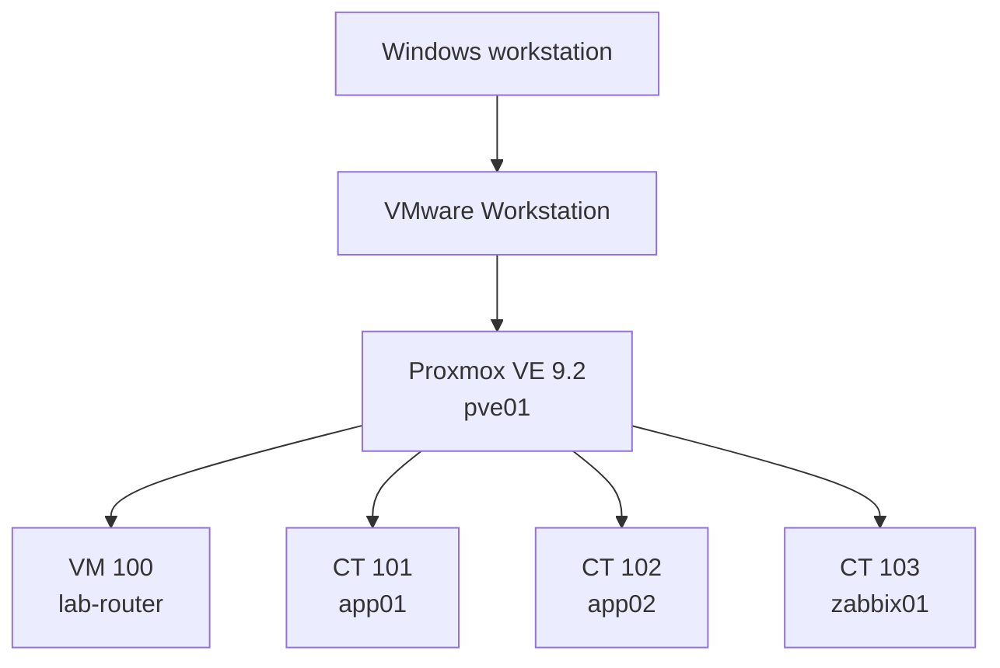

# Architecture

InfraLab is a nested virtualization environment.

## Layers

### Outer virtualization

VMware Workstation hosts the Proxmox VE VM. Hardware virtualization is exposed to the guest so Proxmox can use KVM for nested workloads.

### Proxmox

`pve01` provides the virtualization layer and Layer 2 switching.

- `vmbr0` connects to the VMware-facing management/NAT network.
- `vmbr1` is the internal VLAN-aware bridge.

### Routing

`lab-router` is a Debian 13 VM.

- `ens18`: VMware-facing/WAN side.
- `ens19`: internal VLAN trunk.
- `ens19.20`: `10.20.0.1/24`.
- `ens19.30`: `10.30.0.1/24`.

The router performs:

- IPv4 forwarding;
- inter-VLAN routing;
- internet NAT;
- nftables filtering;
- management-plane isolation.

### Workloads

- `app01`: `10.20.0.11/24`
- `app02`: `10.20.0.12/24`
- `zabbix01`: `10.30.0.10/24`

See [Network design](network-design.md) for packet flow and policy.
