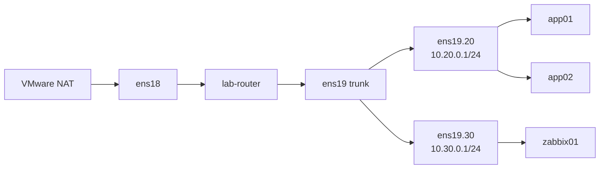

# Network Design

## Addressing

| Network | Purpose | Gateway |
|---|---|---|
| `192.168.74.0/24` | VMware NAT / management-facing network | `192.168.74.2` |
| `10.20.0.0/24` | VLAN 20 — servers | `10.20.0.1` |
| `10.30.0.0/24` | VLAN 30 — monitoring | `10.30.0.1` |

## Proxmox switching

`vmbr0` carries management/WAN-side traffic.

`vmbr1` is an internal VLAN-aware bridge used for the lab trunk.

The router receives the internal network on `ens19` and terminates VLAN 20 and VLAN 30 with Linux VLAN subinterfaces.

## Router-on-a-stick



## Forwarding policy

The router uses a default-drop forward chain.

Required flows:

| Source | Destination | Port / protocol | Action |
|---|---|---|---|
| VLAN 20 | Internet | general | allow |
| VLAN 30 | Internet | general | allow |
| `zabbix01` | VLAN 20 | TCP/10050 | allow |
| VLAN 20 | `zabbix01` | TCP/10051 | allow |
| Management | `zabbix01` | TCP/8080 | allow |
| VLAN 20 | Management subnet | general | drop |
| VLAN 30 | Management subnet | general | drop |
| Established / related | return traffic | stateful | allow |
| ICMP | troubleshooting | ICMP | allow |

See [`../configs/nftables/nftables.conf.example`](../configs/nftables/nftables.conf.example).

## Management isolation

The application VLAN was tested against the Proxmox management UI.

```bash
curl -k --connect-timeout 5 --max-time 7 \
  https://192.168.74.128:8006 -o /dev/null
echo $?
```

The connection timed out with exit code `28`, which was the expected result.
