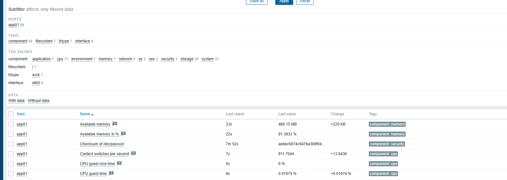

# Screenshot Gallery

These screenshots are intentionally limited to evidence that adds something to the technical story.

## Proxmox overview

## Router VLAN verification

## app01 Latest Data

## Zabbix failure simulation

## DNS / firewall debugging

## Management isolation

## systemd timers

## Final host state

